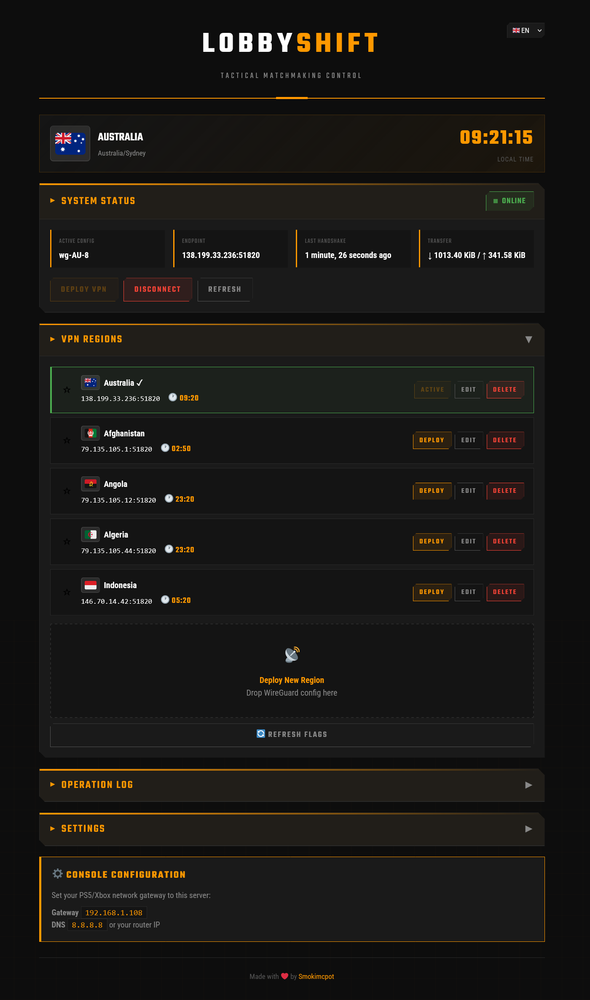

# 🎯 LOBBYSHIFT

```
██╗      ██████╗ ██████╗ ██████╗ ██╗   ██╗███████╗██╗  ██╗██╗███████╗████████╗
██║     ██╔═══██╗██╔══██╗██╔══██╗╚██╗ ██╔╝██╔════╝██║  ██║██║██╔════╝╚══██╔══╝
██║     ██║   ██║██████╔╝██████╔╝ ╚████╔╝ ███████╗███████║██║█████╗     ██║   
██║     ██║   ██║██╔══██╗██╔══██╗  ╚██╔╝  ╚════██║██╔══██║██║██╔══╝     ██║   
███████╗╚██████╔╝██████╔╝██████╔╝   ██║   ███████║██║  ██║██║██║        ██║   
╚══════╝ ╚═════╝ ╚═════╝ ╚═════╝    ╚═╝   ╚══════╝╚═╝  ╚═╝╚═╝╚═╝        ╚═╝   
```

<p align="center">
  <strong>▶ TACTICAL MATCHMAKING CONTROL SYSTEM ◀</strong>
</p>

<p align="center">
  
  
  
</p>

<p align="center">
  <a href="#-mission-briefing">Mission Briefing</a> •
  <a href="#-tactical-features">Features</a> •
  <a href="#-deployment">Deployment</a> •
  <a href="#-field-manual">Field Manual</a> •
  <a href="#-intel">Intel</a>
</p>

---

## 📋 MISSION BRIEFING

**CLASSIFICATION:** Public Release  
**OPERATION:** Matchmaking Optimization  
**TARGET:** SBMM-Protected Lobbies

LobbyShift is a **self-hosted tactical VPN gateway** designed to intercept and reroute Call of Duty matchmaking traffic through global server nodes. This allows operatives to access alternative matchmaking regions while maintaining optimal combat latency.

**PRIMARY OBJECTIVES:**
- ✅ Bypass regional matchmaking restrictions
- ✅ Maintain low-latency gameplay connections
- ✅ Zero subscription fees
- ✅ Full operational security (self-hosted)

> *"Why pay for services when you can deploy your own?"*

---

## ⚡ TACTICAL FEATURES

| SYSTEM | CAPABILITY |
|--------|------------|
| 🌍 **Region Switching** | Deploy to any VPN node with one click |
| 🎯 **Split Tunneling** | Only matchmaking traffic (185.34.0.0/16) is rerouted |
| ⚡ **Low Latency** | Game traffic stays direct – zero impact on ping |
| 🖥️ **Command Center** | Military-grade web interface with timezone intel |
| ⭐ **Quick Deploy** | Pin favorite regions for rapid switching |
| 📜 **Operation Log** | Track all connection history |
| 🌐 **Auto Detection** | GeoIP identifies VPN server location |
| 🎮 **Multi-Platform** | PS5, Xbox Series X|S, PC compatible |
| 🔒 **OPSEC** | Self-hosted, no data exfiltration |

---

## 🔧 SYSTEM ARCHITECTURE

```
                         ┌─────────────────────────────────────┐
                         │         LOBBYSHIFT GATEWAY          │
                         │        ┌─────────────────┐          │
┌──────────────┐         │        │   WEB COMMAND   │          │
│    PS5 /     │         │        │     CENTER      │          │
│   XBOX /     │────────▶│        │    :8080        │          │
│     PC       │         │        └────────┬────────┘          │
└──────────────┘         │                 │                   │
   Gateway:              │    ┌────────────┴────────────┐      │
   192.168.1.x           │    ▼                         ▼      │
                         │ ┌──────┐              ┌──────────┐  │
                         │ │DIRECT│              │ WIREGUARD│  │
                         │ │ROUTE │              │  TUNNEL  │  │
                         │ └──┬───┘              └────┬─────┘  │
                         │    │                       │        │
                         └────┼───────────────────────┼────────┘
                              │                       │
                              ▼                       ▼
                    ┌─────────────────┐    ┌─────────────────┐
                    │  REGULAR TRAFFIC │    │ COD MATCHMAKING │
                    │  YouTube, etc.   │    │  185.34.0.0/16  │
                    │     ↓            │    │       ↓         │
                    │   INTERNET       │    │  VPN SERVER     │
                    │                  │    │  (MX/TR/JP...)  │
                    └─────────────────┘    └─────────────────┘
```

**TRAFFIC FLOW:**
1. Console/PC designates LobbyShift as network gateway
2. Standard traffic → Direct route to internet
3. CoD matchmaking IPs → Encrypted tunnel to VPN node
4. Matchmaking server sees VPN location → Alternative region lobbies
5. Game server connection → Direct route → Minimal latency

---

## 📋 SYSTEM REQUIREMENTS

**HARDWARE:**
- Raspberry Pi 4+ (recommended)
- Any Ubuntu/Debian server
- Minimum 1GB RAM

**SOFTWARE:**
- Ubuntu 20.04+ / Debian 11+ / Raspberry Pi OS
- WireGuard-compatible VPN subscription

**SUPPORTED VPN PROVIDERS:**

| Provider | Free Tier | Recommended |
|----------|-----------|-------------|
| [ProtonVPN](https://protonvpn.com) | ✅ Yes | ⭐ Best for beginners |
| [Mullvad](https://mullvad.net) | ❌ No | ⭐ Best privacy |
| [IVPN](https://ivpn.net) | ❌ No | Good alternative |
| [Windscribe](https://windscribe.com) | ✅ Limited | Budget option |

---

## 🗺️ REGIONAL INTELLIGENCE

| REGION | CODE | DIFFICULTY | PROTONVPN |
|--------|------|------------|-----------|
| 🇲🇽 Mexico | MX | 🟢 Easy | **Free** ✓ |
| 🇹🇷 Turkey | TR | 🟢 Easy | Plus |
| 🇪🇬 Egypt | EG | 🟢 Easy | Plus |
| 🇿🇦 South Africa | ZA | 🟢 Easy | Plus |
| 🇯🇵 Japan | JP | 🟡 Medium | **Free** ✓ |
| 🇳🇱 Netherlands | NL | 🟡 Medium | **Free** ✓ |
| 🇧🇷 Brazil | BR | 🟡 Medium | Plus |
| 🇦🇷 Argentina | AR | 🟢 Easy | Plus |
| 🇺🇸 USA | US | 🔴 Hard | **Free** ✓ |

> **INTEL:** ProtonVPN Free provides access to Japan, Netherlands, USA, and Mexico. Sufficient for initial operations.

---

## 🚀 DEPLOYMENT

### Quick Deploy (Recommended)

```bash
# Clone repository
git clone https://github.com/Smokimcpot/LobbyShift.git
cd LobbyShift

# Execute deployment
chmod +x install.sh
sudo ./install.sh
```

**DEPLOYMENT CHECKLIST:**
- ✅ WireGuard installation
- ✅ Python environment setup
- ✅ Network configuration (iptables)
- ✅ Systemd service creation
- ✅ Web interface deployment

### Manual Deployment

<details>
<summary>▶ EXPAND MANUAL INSTRUCTIONS</summary>

```bash
# Install dependencies
sudo apt update
sudo apt install -y wireguard wireguard-tools python3 python3-pip python3-venv iptables iptables-persistent

# Create directories
sudo mkdir -p /opt/lobbyshift
sudo mkdir -p /etc/lobbyshift/configs

# Clone and deploy
git clone https://github.com/Smokimcpot/LobbyShift.git
cd LobbyShift
sudo cp -r * /opt/lobbyshift/

# Python environment
cd /opt/lobbyshift
sudo python3 -m venv venv
sudo ./venv/bin/pip install -r requirements.txt

# Enable IP forwarding
echo "net.ipv4.ip_forward=1" | sudo tee /etc/sysctl.d/99-lobbyshift.conf
sudo sysctl -w net.ipv4.ip_forward=1

# Deploy service
sudo cp systemd/lobbyshift.service /etc/systemd/system/
sudo systemctl daemon-reload
sudo systemctl enable lobbyshift
sudo systemctl start lobbyshift
```

</details>

---

## 📖 FIELD MANUAL

### 1. Access Command Center

<p align="center">
  
</p>

```
http://<SERVER-IP>:8080
```

### 2. Upload VPN Configs

1. Acquire WireGuard configs from VPN provider
2. Access LobbyShift web interface
3. Drag & drop `.conf` files to upload zone
4. System auto-configures split tunneling

### 3. Configure Console

#### PLAYSTATION 5

| PARAMETER | VALUE |
|-----------|-------|
| IP Address | Automatic |
| Subnet Mask | `255.255.255.0` |
| **Gateway** | **LobbyShift Server IP** |
| DNS Primary | Router IP or `8.8.8.8` |
| DNS Secondary | `1.1.1.1` |

**PATH:** Settings → Network → Set Up Internet Connection → Advanced Settings

#### XBOX SERIES X|S

| PARAMETER | VALUE |
|-----------|-------|
| IP Address | Keep current |
| Subnet Mask | `255.255.255.0` |
| **Gateway** | **LobbyShift Server IP** |
| DNS Primary | `8.8.8.8` |
| DNS Secondary | `1.1.1.1` |

**PATH:** Settings → General → Network Settings → Advanced Settings → IP Settings

#### PC

**PATH:** Network Settings → Change Adapter Options → Properties → IPv4  
**SET:** Default Gateway → LobbyShift Server IP

### 4. Deploy Region

1. Select target region in Command Center
2. Click **[DEPLOY]**
3. **RESTART GAME** for changes to take effect
4. Engage easier lobbies

---

## ⌨️ CLI OPERATIONS

```bash
# System status
lobbyshift status

# List available regions
lobbyshift list

# Deploy region
lobbyshift switch mexico

# Start/Stop operations
lobbyshift up
lobbyshift down

# Live intel feed
lobbyshift logs

# Restart service
lobbyshift restart
```

---

## 🔌 API ENDPOINTS

| ENDPOINT | METHOD | OPERATION |
|----------|--------|-----------|
| `/api/status` | GET | System status |
| `/api/configs` | GET | List all regions |
| `/api/configs` | POST | Upload new region |
| `/api/configs/{name}` | GET | Get config content |
| `/api/configs/{name}` | PUT | Update config |
| `/api/configs/{name}` | DELETE | Remove region |
| `/api/switch/{name}` | POST | Deploy region |
| `/api/up` | POST | Start VPN |
| `/api/down` | POST | Stop VPN |
| `/api/favorites` | GET | List favorites |
| `/api/favorites/{name}` | POST | Add to favorites |
| `/api/favorites/{name}` | DELETE | Remove from favorites |
| `/api/logs` | GET | Operation history |
| `/api/logs` | DELETE | Clear history |

---

## ❓ INTEL (FAQ)

<details>
<summary><strong>▶ Compatible with Warzone 2026/MW3/Black Ops 6?</strong></summary>

**AFFIRMATIVE.** LobbyShift is compatible with all Call of Duty titles utilizing the 185.34.0.0/16 matchmaking range.

</details>

<details>
<summary><strong>▶ Risk of account termination?</strong></summary>

**LOW RISK.** VPN usage technically violates Activision ToS. However, detection is rare. Thousands of operatives use VPN services daily. Recommend using secondary account for operations.

</details>

<details>
<summary><strong>▶ High latency issues?</strong></summary>

**CHECK:** Verify `AllowedIPs` in WireGuard config is set to `185.34.0.0/16` and NOT `0.0.0.0/0`. LobbyShift auto-configures this on upload.

</details>

<details>
<summary><strong>▶ Multi-device support?</strong></summary>

**AFFIRMATIVE.** Any device using LobbyShift as gateway will have CoD traffic routed through VPN.

</details>

<details>
<summary><strong>▶ VPN subscription required?</strong></summary>

**NEGATIVE.** ProtonVPN Free provides servers in Japan, Netherlands, USA, Mexico. Sufficient for initial operations. Plus subscription unlocks additional regions.

</details>

---

## 🛠️ TROUBLESHOOTING

### No Internet After Gateway Configuration

```bash
# Verify IP forwarding
cat /proc/sys/net/ipv4/ip_forward  # Should output: 1

# Check iptables rules
sudo iptables -t nat -L -v -n
```

### VPN Connection Failure

```bash
# WireGuard status
sudo wg show

# Service status
sudo systemctl status lobbyshift

# Live logs
sudo journalctl -u lobbyshift -f
```

### Web Interface Unavailable

```bash
# Service check
sudo systemctl status lobbyshift

# Port verification
sudo ss -tlnp | grep 8080
```

---

## 🤝 CONTRIBUTING

Contributions welcome. See [CONTRIBUTING.md](CONTRIBUTING.md) for guidelines.

**AREAS OF INTEREST:**
- 🐳 Docker containerization
- 🌐 Additional VPN provider templates
- 🌍 Localization support

---

## ⚠️ DISCLAIMER

```
THIS SOFTWARE IS PROVIDED FOR EDUCATIONAL PURPOSES ONLY.

Using VPNs to manipulate matchmaking may violate game Terms of Service.
The developers assume no responsibility for account penalties or bans.

OPERATE AT YOUR OWN RISK.
```

---

## 📄 LICENSE

**Creative Commons Attribution-NonCommercial 4.0 International (CC BY-NC 4.0)**

| PERMITTED | PROHIBITED |
|-----------|------------|
| ✅ Personal use | ❌ Commercial use |
| ✅ Modification | ❌ Selling software |
| ✅ Distribution | ❌ Paid services |

See [LICENSE](LICENSE) for full terms.

---

## ⭐ SUPPORT THE MISSION

If this project provided value, consider leaving a ⭐

---

<p align="center">
  <strong>━━━━━━━━━━━━━━━━━━━━━━━━━━━━━━━━━━━━━━━━</strong>
</p>

<p align="center">
  Made with ❤️ by <a href="https://github.com/Smokimcpot">Smokimcpot</a>
</p>

<p align="center">
  <strong>▶ LOBBYSHIFT v1.0 ◀</strong>
</p>
